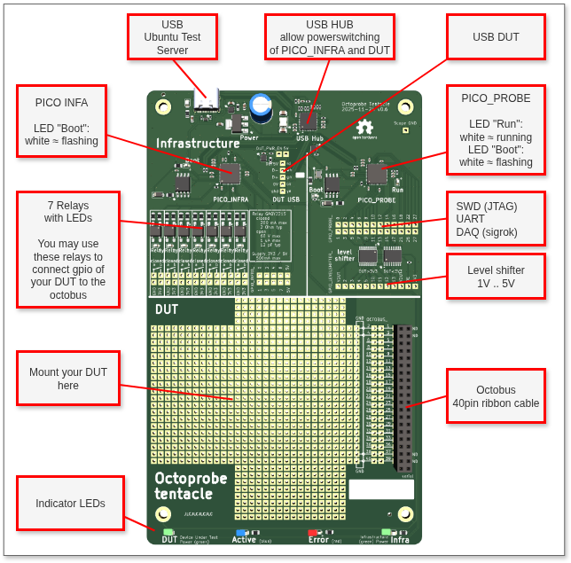

Big Picture
===========================

A Octopus is flexible in using its tentacles. The same sence Octoprobe is flexible in using its tentacle PCB.

Features
-----------------

Recommended BOM
^^^^^^^^^^^^^^^^^^^^^^^^^^^^^^^^^^^^

Order recommended parts to assemble your tentacles: :doc:`Parts list <pcb/bom>`

Fast and cheap manufacturing
^^^^^^^^^^^^^^^^^^^^^^^^^^^^^^^^^^^^

The assembled PCB may be ordered at https://www.jclpcb.com. The production files are located here: `kicad/tentacle_v0.x/production_v0.x`.

The price of a assembled PCB is ~USD12 when ordering 20 pieces.

Power Management
^^^^^^^^^^^^^^^^^^^^^^^^^

**Problem**

When many tentacles/DUT power up at the same time, the USB hubs or computer may not deliver sufficient power to load all capacitors at once.
As a result of this, other tentacles which run tests at this very moment may see a voltage drop and the the test would fail in a very flaky behaviour.

**Solution**

Two `TPS2595xx` chips do limit the current to 800mA and the voltage with a slew rate ov 5V/s. In other words, the tentacle takes 1s to power on.

Relays
^^^^^^^^^^^^^^^^^^^^^^^^^

The 7 relays are for general use. For example to bring press the boot-button on the DUT.

As the relays are opto-coupled and therefor you do not have to care about voltage-leves.

PICO_INFRA
^^^^^^^^^^^^^^^^^^^^^^^^^

This Raspberry Pi Pico runs micropython and controls the tentacle infrastructure as relays, LEDs, power and bootmode of PICO_PROBE.

It also may be used to control some gpio for stimuly/measurements of the DUT.

PICO_PROBE
^^^^^^^^^^^^^^^^^^^^^^^^^

PICO_PROBE was just added to the PCB as for a small amount of two USD useful features can be provided.

This Raspberry Pi Pico may run a firmware specific to the need of the test setup. This page lists of recommended firmwares: :doc:`/rp2_probe`.

One use case would be to use the firmware of the Raspberry Pi Debug Probe which supports SWD and UART.

Level Shifter
^^^^^^^^^^^^^^^^^^^^^^^^^

Chip used: `TXB0108 8-Bit Bidirectional Voltage-Level Translator with Auto-Direction Sensing`

This chip autosenses the direction of control and is specified to be able to handle SWD and I2C.

There is a very important sentence in the datasheet: `VCCA should not exceed VCCB`. This requires to switch the sides of the level shifter depending if the VCC of the DUT is above or below 3V3.

Therefore it is up to you to solder the chip depending on the use case.

This is an example on how to use the PICO_PROBE with SWD and level shifter to 1.8V: :doc:`testbed_micropython:tentacle_design/50_tentacle_spec_NRF52840_USB_DONGLE`
