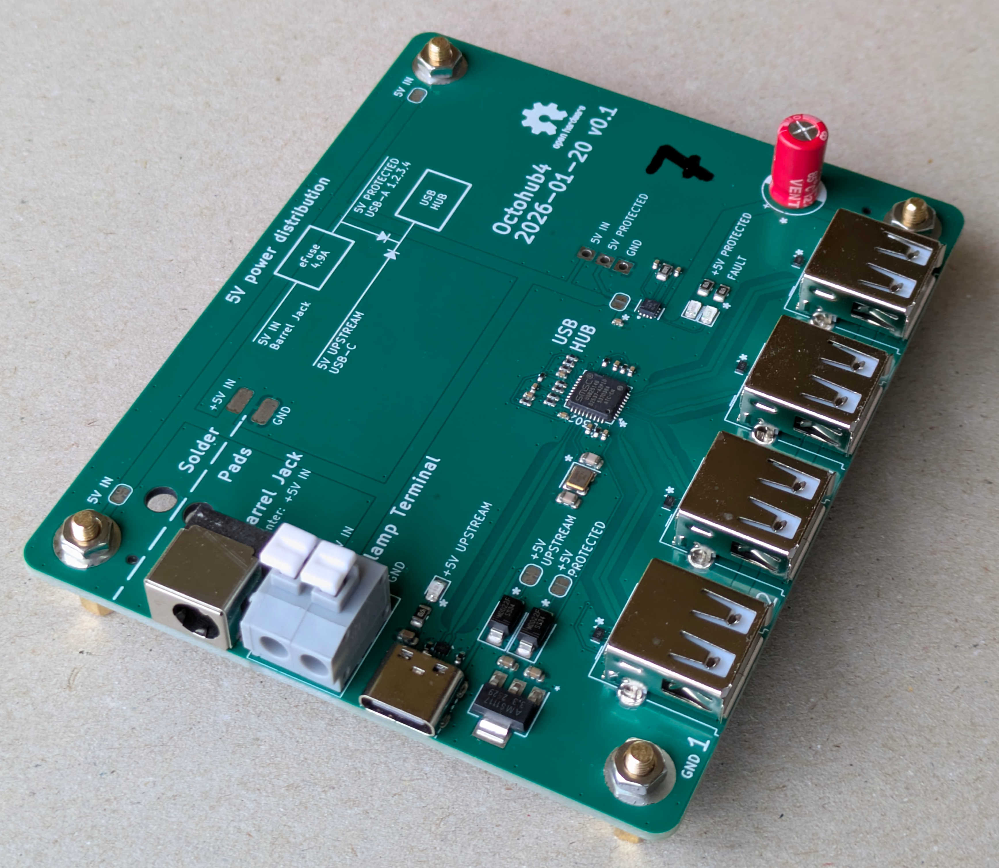
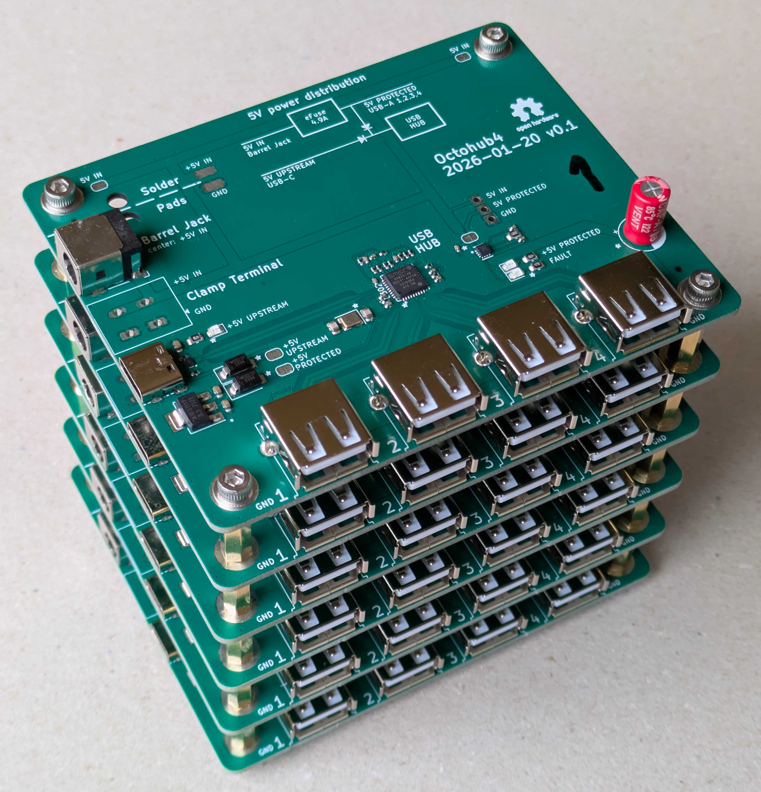

Big Picture
===========================

.. .. image:: octohub4_images/image.png
..    :height: 300px

There are many good hubs on the market. For example:

 * https://www.dlink.com/de/de/products/dub-h7-7-port-usb-2-0-hub

   * positive: cheap, widely available
   * positive: USB2. No unneeded USB3 complexity.
   * negative: chipset not specified - may be changed by manufacturer
   * negative: Very low cost chip FE1.1S
   * negative: Voltage on the USBA connector may drop below 4.7V
   * negative: USB geometry asymmetrical: Internally 2 USB hubs. We might hit the 7 tiers limit of USB.

 * https://www.rshtech.com/products/16-ports-aluminum-usb-30-data-hub-with-12v-83a-with-uk-power-adapterrsh-a16

   * positive: cheap, widely available
   * positive: USB3. As we only require USB2, USB3 is unwanted complexity
   * negative: chipset not specified - may be changed by manufacturer
   * negative: Voltage on the USBA connector unknown
   * negative: USB geometry asymmetrical: Internally 5 USB 4-port-hubs. It would have been possible to have a top 4-port-hub with 4 downstreams hubs, thus requireing 2 usb tiers. But this is not the case: The internal hubs are assymetrical requiring 3 tiers!!!

The benefits of octohub4:

  * negative: Not out of the box. Needs to be ordered in china.
  * positive: Know and stable USB 2 chip USB2514B_Bi.
  * positive: USB geometry symmetrical: We hit the 7 tier limit later.
  * positive: Excellent 5V power management

Features
-----------------

Recommended BOM
^^^^^^^^^^^^^^^^^^^^^^^^^^^^^^^^^^^^

Order recommended parts to assemble your tentacles: :doc:`Parts list <pcb/bom>`

Fast and cheap manufacturing
^^^^^^^^^^^^^^^^^^^^^^^^^^^^^^^^^^^^

The assembled PCB may be ordered at https://www.jclpcb.com. The production files are located here: `kicad/octohub4_v0.x/production_v0.x`.

The price of a assembled PCB is ~USD9 when ordering 20 pieces.

Power Management
^^^^^^^^^^^^^^^^^^^^^^^^^

`TPS259474LRPWR` chip

* limit the current to 4.9A
* Voltage slew rate: The Voltage will raise from 0 to 5V withing 12ms.
* Overcurrent: I there is overcurrent during 500m:
  * The outputs will be unpowered
  * Red error led

Power input
^^^^^^^^^^^^^^^^^^^^^^^^^

The power may be provieded by ether

* Standard 5V power displays with a 5.5mm Barrel Jack. Central plug is +5V.
* Clamp terminal
* Solder terminal

Stacking
^^^^^^^^^^^^^^^^^^^^^^^^^

Stacking using M3 standoff mounts. The standoff mounts connect the 5V power - only one hub requires to be powered!

Reduce number of tiers
^^^^^^^^^^^^^^^^^^^^^^^^^

This article explains usb tiers: https://community.crestron.com/s/article/3082

In octoprobe we experienced USB errors under high load. If these errors are debian internal or related to the usb hardware is not know.

However, it is always best to try not to reach the maximum level of 7 usb tears. With octohub4 we have control over the adding new tears by wireing usb upstream

