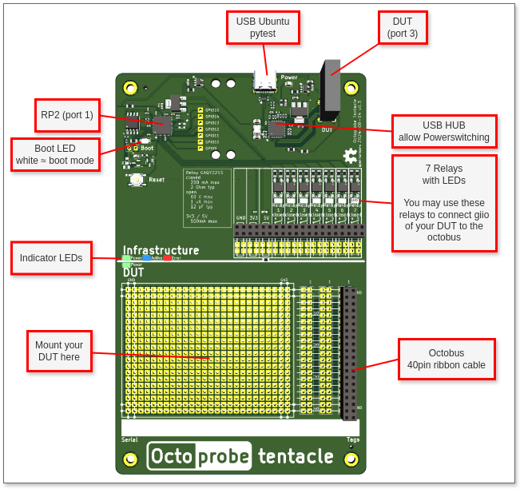

Tentacle v0.3 (30 pieces produced)
====================================================

This repo describes the hardware of a tentacle:

Schematics
----------

:download:`Schematics v0.3 (Pdf) <../kicad/tentacle_v0.3/production_v0.3/schematics_tentacle_v0.3.pdf>`.

PCB
---
:doc:`Parts list <pcb/bom>`

The assembled PCB may be ordered at https://www.jclpcb.com. The production files are located here: `kicad/tentacle_v0.3/production_v0.3`.

The price of a assembled PCB is ~USD10 when ordering 30 pieces.

The tentacle is described in more detail in :doc:`octoprobe:big_picture`

