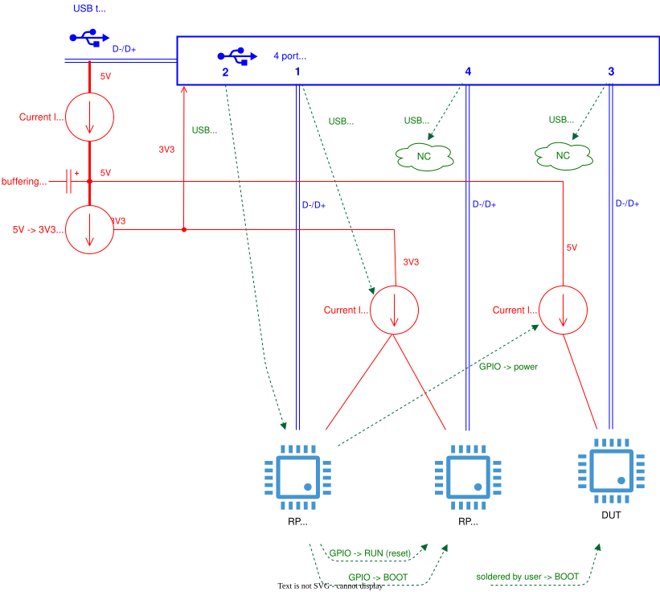

Tentacle v0.5 (not supported)
==================================

.. warning::

    Version v0.4 is now obsolete as it has been superseded by v0.6!

This repo describes the hardware of a tentacle:

See also: :doc:`tentacle_v0.3`

Schematics
----------

:download:`Schematics v0.5 (Pdf) <../kicad/tentacle_v0.5/production_v0.5/schematics_tentacle_v0.5.pdf>`.

PCB
---
:doc:`Parts list <pcb/bom>`

The assembled PCB may be ordered at https://www.jclpcb.com. The production files are located here: `kicad/kicad_tentacle_v0.5/production_v0.5`.

The price of a assembled PCB is ~USD12 when ordering 30 pieces.

The tentacle is described in more detail in :doc:`octoprobe:big_picture`

.. image:: tentacle_images/tentacle_intro_v0.5.drawio.png

USB and Power
-----------------

This block diagram shows the power distribution with MT9700 switches and how to enable boot mode for `RP_INFRA` and `RP_PROBE`.

