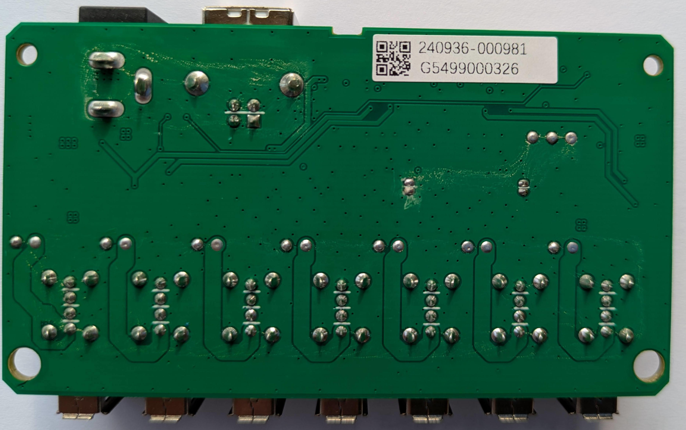
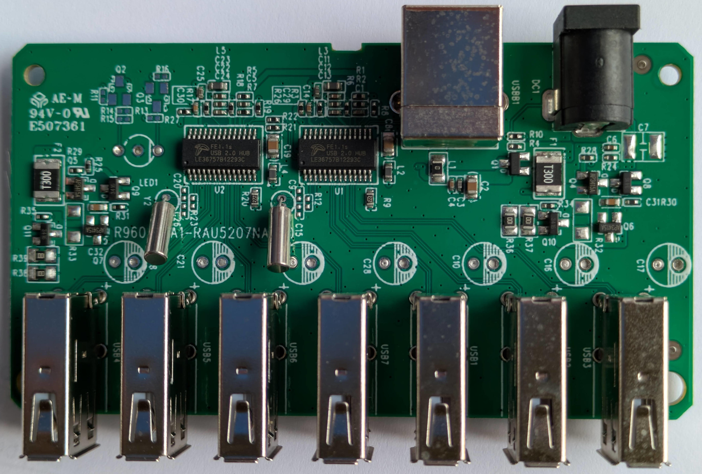
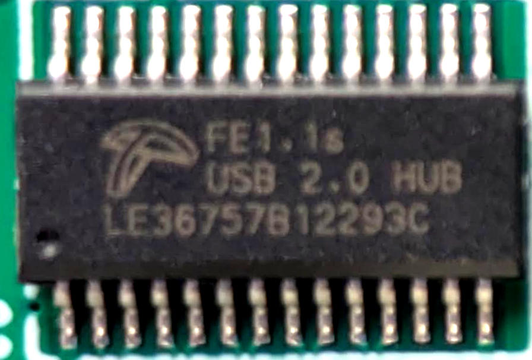

# USB Hub D-Link DHUB-H7 

This page describes the USB hub which is used in the octoprobe infrastructure.

[D-Link: Product Page](https://www.dlink.com/uk/en/products/dub-h7-7-port-usb-2-0-hub)

[D-Link: Datasheet](https://www.dlink.com/uk/en/-/media/consumer_products/dub/dub-h7/datasheet/dub_h7_f1_datasheet_en_eu.pdf)

[Chip: Product](https://terminus-usa.com/product/fe1-1-usb-2-0-high-speed-4-port-hub-controller/)

[Chip: Product Brief](https://terminus-usa.com/wp-content/uploads/2024/06/FE1.1-Product-Brief-Rev.-2.0-2020.pdf)

[Chip: Datasheet](https://cdn-shop.adafruit.com/product-files/2991/FE1.1s%20Data%20Sheet%20(Rev.%201.0).pdf)

[MOSFET: AP3415A](http://www.apm-mos.com/uploadfiles/2023/09/AP3415AI%20-4.2A%20-20V%20SOT23.pdf
)

## Measuring static voltages

## Setup

* Leftmost plug: Tentacle `2d2a ES32_DEVKIT`
  * `Power Z`: 4.945V, 125mA
* Hub powered.
* Hub connected to the PC so that DUT is powerered.

| Voltage | Voltage Drop | Location | Comment |
| - | - | - | - |
| 5.113V | | Connector Power Supply. NO LOAD! |
| 4.982V | 141mV | Hub PCB: Connector Power Supply |
| 4.964V | 8mV | Hub PCB: Plug 1 |

## Load 125mA -> 250mA

As above but

* Second leftmost plug: Tentacle `5d21 ES32_DEVKIT`

Total load: 250mA

| Voltage | Voltage Drop | Location | Load |
| - | - | - | - |
| 4.930V |  | Hub PCB: Connector Power Supply, 125mA load |
| 4.893V | 36mV | Hub PCB: Connector Power Supply, 250mA load |

## Load 0mA -> 

Connect Handy to leftmost plug

| Voltage | Voltage Drop | Load |
| - | - | - |
| 4.969V |  | 0mA |
| 4.676V | 293mV | 730mA |
