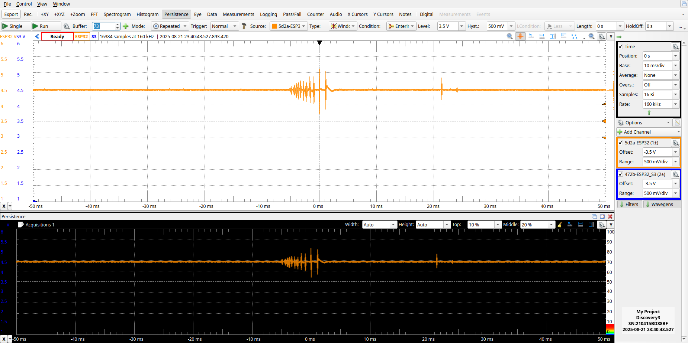
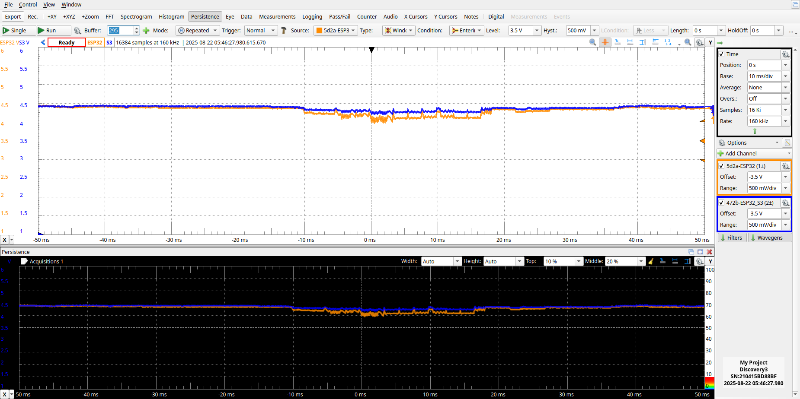
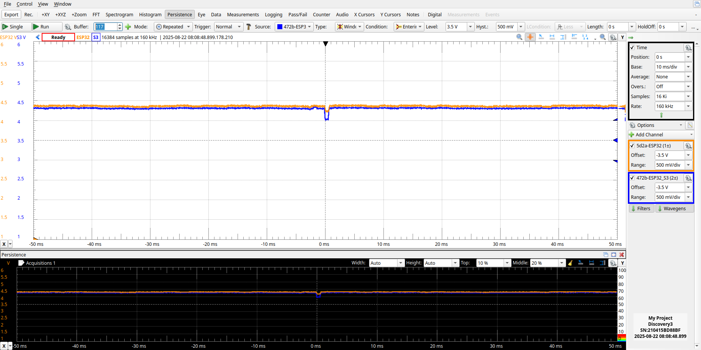
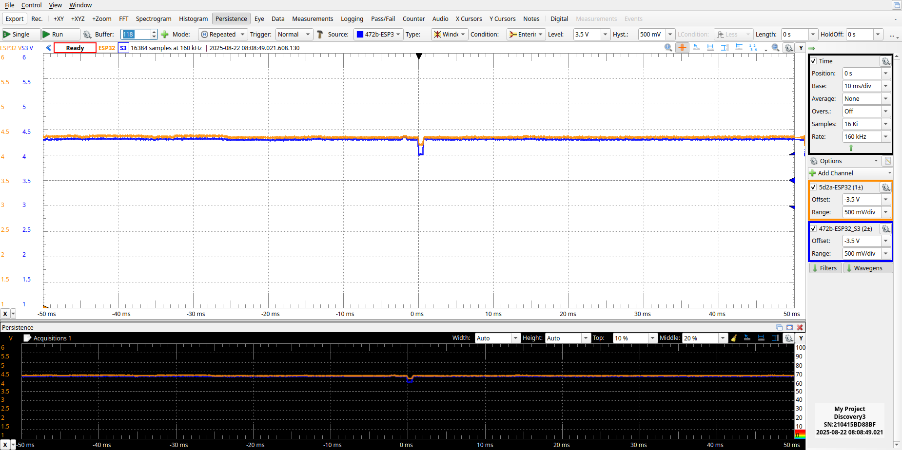
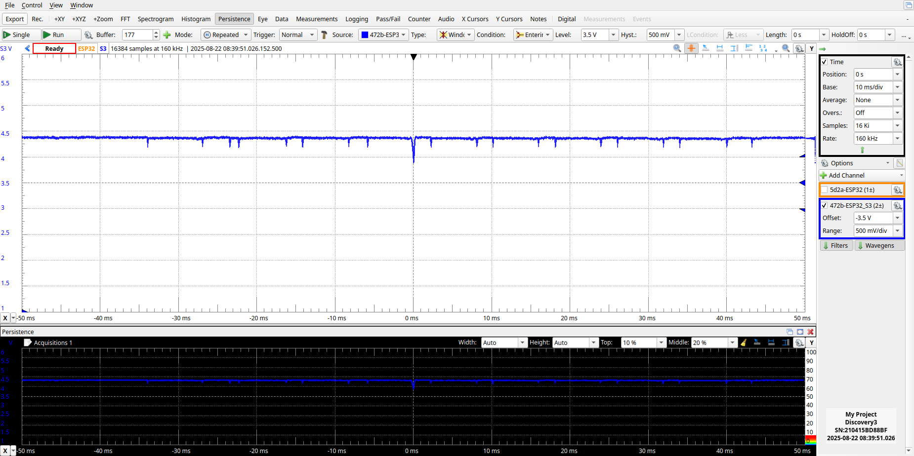

Boards to observe
  See: https://reports.octoprobe.org/github_selfhosted_testrun_256/octoprobe_summary_report.html

  5d21-ESP32_DEVKIT
    Flaky:
      RUN-TESTS_STANDARD
        extmod/asyncio_current_task.py
        extmod/asyncio_event.py
        extmod/asyncio_event_fair.py
        extmod/asyncio_event_queue.py


## Cabling

See: https://digilent.com/reference/test-and-measurement/analog-discovery-3/reference-manual

| AD3 | Board |
| - | - |
| 1-/1+ | 5d21-ESP32_DEVKIT |
| 2-/2+ | 472b-ESP32_S3_DEVKIT |


## Scope - A

Time, Base: 10ms/div
Time, Samples: 16 Ki
Time, Rate: 160 kHz

Channel 1/2: Sample Mode: Min/Max

Buffer, Buffers: 10k
Buffer, Run: Continous
Buffer, Run: Clear on Start
Buffer, Run: Run Reset
Buffer, Mode: Repeated

Trigger: Normal
Trigger, Source: Channel 1
Trigger, Type: Edge
Trigger, Condition: Falling
Trigger, Level: 4.3V
Trigger, Hyst: 20mV


## Scope - B

Time, Base: 10ms/div
Time, Samples: 16 Ki
Time, Rate: 160 kHz

Channel 1/2: Sample Mode: Min/Max
Channal 1, Name: 5d2a-ESP32
Channal 1, Label: ESP32
Channal 2, Name: 472b-ESP32_S3
Channal 2, Label: S3


Buffer, Buffers: 10k
Buffer, Run: Continous
Buffer, Run: Clear on Start
Buffer, Run: Run Reset
Buffer, Mode: Repeated

Trigger: Normal
Trigger, Source: Channel 1
Trigger, Type: Window
Trigger, Condition: Entering
Trigger, Level: 3.5 V
Trigger, Hyst: 500 mV

## Setup

2 hubs [Dlink H7, HW Version F1

[Product](https://www.dlink.com/de/de/products/dub-h7-7-port-usb-2-0-hub),
[Datasheet](https://support.dlink.com/resource/PRODUCTS/DUB-H7/REVF/DUB-H7_F1_Datasheet_v1.00%28WW%29.pdf),
[Guide](https://support.dlink.com/resource/PRODUCTS/DUB-H7/REVF/DUB-H7_F1_QIG_v1.00.pdf)

Connected tentacles: 13

```
  Tentacle 1830-LOLIN_C3_MINI
    variants=LOLIN_C3_MINI
    futs=FUT_MCU_ONLY,FUT_EXTMOD_HARDWARE
  Tentacle 3c2a-ARDUINO_NANO_33
    variants=ARDUINO_NANO_33_BLE_SENSE
    futs=FUT_MCU_ONLY,FUT_EXTMOD_HARDWARE
  Tentacle 1133-TEENSY40
    variants=TEENSY40
    futs=FUT_MCU_ONLY,FUT_EXTMOD_HARDWARE
  Tentacle 2f2c-NUCLEO_WB55
    variants=NUCLEO_WB55
    futs=FUT_MCU_ONLY,FUT_EXTMOD_HARDWARE,FUT_BLE
  Tentacle 5d21-ESP32_DEVKIT
    variants=ESP32_GENERIC
    futs=FUT_MCU_ONLY,FUT_EXTMOD_HARDWARE,FUT_WLAN,FUT_BLE
  Tentacle 472b-ESP32_S3_DEVKIT
    variants=ESP32_GENERIC_S3
    futs=FUT_MCU_ONLY,FUT_EXTMOD_HARDWARE,FUT_WLAN,FUT_BLE
  Tentacle 5f2c-RPI_PICO_W
    variants=RPI_PICO_W
    futs=FUT_MCU_ONLY,FUT_EXTMOD_HARDWARE,FUT_WLAN,FUT_BLE
  Tentacle 2d2d-LOLIN_D1_MINI
    variants=ESP8266_GENERIC,ESP8266_GENERIC-FLASH_512K
    futs=FUT_MCU_ONLY,FUT_EXTMOD_HARDWARE,FUT_WLAN
  Tentacle 0c30-ESP32_C3_DEVKIT
    variants=ESP32_GENERIC_C3
    futs=FUT_MCU_ONLY,FUT_EXTMOD_HARDWARE,FUT_WLAN,FUT_BLE
  Tentacle 2731-RPI_PICO2
    variants=RPI_PICO2,RPI_PICO2-RISCV
    futs=FUT_MCU_ONLY,FUT_EXTMOD_HARDWARE
  Tentacle 3a21-PYBV11
    variants=PYBV11,PYBV11-DP,PYBV11-THREAD,PYBV11-DP_THREAD
    futs=FUT_MCU_ONLY,FUT_EXTMOD_HARDWARE
  Tentacle 552b-RPI_PICO2_W
    variants=RPI_PICO2_W
    futs=FUT_MCU_ONLY,FUT_EXTMOD_HARDWARE,FUT_WLAN,FUT_BLE
  Tentacle 5f2a-ADA_ITSYBITSY_M0
    variants=ADAFRUIT_ITSYBITSY_M0_EXPRESS
    futs=FUT_MCU_ONLY,FUT_EXTMOD_HARDWARE
```

Test run: `mptest test --count=10`

## Measurements

2025-08-21_voltage-monitoring_b_1_*.png Trigger: ESP32
2025-08-21_voltage-monitoring_b_2_*.png Trigger: ESP32_S3

ESP32 was much more instable





ESP32_S3 just had a few times undervolate









## Measurement static voltage

5.145V: Voltage on the powersupplies of the Dlink H7 hub. Load 0A

4.86V: On USB cable connected to the Dlink H7 hub. Load 0A.
4.83V: On USB cable connected to the Dlink H7 hub. Load 0.13A (ESP32 tentacle).

| Voltage | Drop | Load | Location | Comment |
| - | - | - | - | - |
| 5.145V | | 0mA | Dlink H7 Powersupply | |
|  | 0.315V | 130mA | Dlink H7 Hub | |
| 4.83V | | 130mA | Dlink H7 USB Plug | |
|  | 0.048V | 130mA | USB cable, tentacle | |
| 4.782 | | 130mA | Tentacle MT9700 VIN | |
|  | 0.012V | 130mA | MT9700 | |
| 4.777 | | 130mA | Tentacle MT9700 VOUT | |
|  | 0.286V | 130mA | Usb cable DUT | |
| 4.490 | | 130mA | Tentacle DUT | |

| 4.478 | | 130mA | Tentacle PAD 0V-5V | |

## Conclusion

The voltage measured on the DUT board is 4.5V and my drop down to 4V for 30ms during the test.

